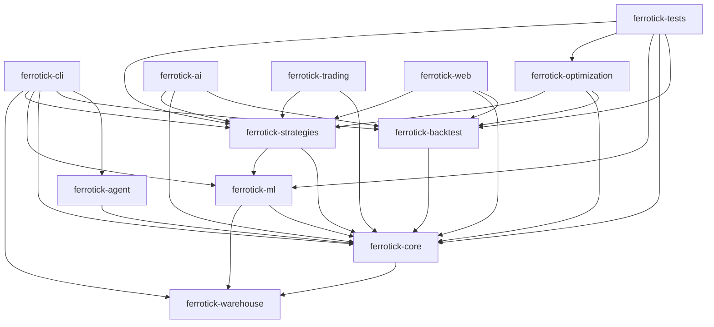

# Ferrotick Architecture Audit

## Scope and method

This audit was produced from:
- All workspace and crate `Cargo.toml` files.
- Rust source structure under `crates/**` and `tests/**`.
- Build graph/tooling checks (`cargo metadata`, `cargo check --workspace --all-targets`, `cargo tree -d`, `tsort`).

Constraint honored: no Markdown documentation files were used as input.

## Dependency graph visualization

## Circular dependency check results

- Result: no circular dependencies detected in workspace crate graph.
- Evidence:
  - `cargo check --workspace --all-targets` completed successfully.
  - `tsort` over workspace edges succeeded and produced a valid topological order.
- Conclusion: the manifest-level crate DAG is acyclic and valid.

## Dependency graph correctness

### Declared vs source-observed workspace dependencies

Comparison done from non-comment `ferrotick_*::` usage in Rust sources.

| Crate | Declared workspace deps | Source-observed workspace deps | Assessment |
|---|---|---|---|
| `ferrotick-agent` | `ferrotick-core` | `ferrotick-core` | Consistent |
| `ferrotick-ai` | `ferrotick-core`, `ferrotick-backtest`, `ferrotick-strategies` | `ferrotick-backtest`, `ferrotick-strategies` | `ferrotick-core` currently unused |
| `ferrotick-backtest` | `ferrotick-core` | `ferrotick-core` | Consistent |
| `ferrotick-cli` | `ferrotick-agent`, `ferrotick-backtest`, `ferrotick-core`, `ferrotick-ml`, `ferrotick-strategies`, `ferrotick-warehouse` | `ferrotick-agent`, `ferrotick-core`, `ferrotick-ml`, `ferrotick-strategies`, `ferrotick-warehouse` | `ferrotick-backtest` currently unused |
| `ferrotick-core` | `ferrotick-warehouse` | `ferrotick-warehouse` | Consistent |
| `ferrotick-ml` | `ferrotick-core`, `ferrotick-warehouse` | `ferrotick-core`, `ferrotick-warehouse` | Consistent |
| `ferrotick-optimization` | `ferrotick-core`, `ferrotick-backtest`, `ferrotick-strategies` | `ferrotick-core`, `ferrotick-backtest` | `ferrotick-strategies` currently unused |
| `ferrotick-strategies` | `ferrotick-core`, `ferrotick-ml` | `ferrotick-core`, `ferrotick-ml` | Consistent |
| `ferrotick-trading` | `ferrotick-core`, `ferrotick-strategies` | `ferrotick-core`, `ferrotick-strategies` | Consistent |
| `ferrotick-warehouse` | none | none | Consistent |
| `ferrotick-web` | `ferrotick-core`, `ferrotick-backtest`, `ferrotick-strategies` | none | All three currently unused |
| `ferrotick-tests` | `ferrotick-core`, `ferrotick-strategies`, `ferrotick-backtest`, `ferrotick-ml`, `ferrotick-optimization` | All used in test targets | Consistent |

### Missing dependency check

- No missing dependencies found for compiled targets.
- Evidence: `cargo check --workspace --all-targets` passed (warnings only, no unresolved crates/imports).

### Notable correctness gaps (non-fatal)

- Stubs/placeholders leave declared deps unused:
  - `ferrotick-web` backtest route is explicitly stubbed (`crates/ferrotick-web/src/routes/backtest.rs:8`).
  - CLI strategy backtest path is TODO (`crates/ferrotick-cli/src/commands/strategy.rs:45`).

## Crate responsibility matrix

| Crate | Primary responsibility | Key structure evidence | Separation quality |
|---|---|---|---|
| `ferrotick-warehouse` | DuckDB storage, migrations, query guardrails | `duckdb`, `migrations`, `views` modules | Clear and focused |
| `ferrotick-core` | Domain contracts, providers/adapters, routing, envelope | `adapters`, `domain`, `routing`, `data_source`, `envelope` | Broad; mixes domain and infrastructure coupling |
| `ferrotick-backtest` | Backtest engines, portfolio, costs, metrics | `engine`, `portfolio`, `costs`, `metrics`, `vectorized` | Clear domain boundary |
| `ferrotick-ml` | Feature engineering, ML models, RL, training | `features`, `models`, `rl`, `training` | Clear, but infrastructure-aware (warehouse dependency) |
| `ferrotick-strategies` | Strategy DSL, strategy implementations, signals/sizing | `dsl`, `strategies`, `signals`, `sizing`, `traits` | Logical, but tightly coupled to ML indicators |
| `ferrotick-optimization` | Parameter search and walk-forward validation | `grid_search`, `walk_forward`, `storage` | Focused |
| `ferrotick-agent` | Agent UX envelope/stream/schema primitives | `envelope`, `stream`, `schema_registry`, `metadata` | Focused |
| `ferrotick-ai` | LLM integration, strategy compiler, reporting | `llm`, `compiler`, `reporting`, `validation` | Focused; one unused core edge |
| `ferrotick-trading` | Broker clients, live/paper execution | `brokers`, `executor`, `paper` | Focused |
| `ferrotick-cli` | User command orchestration and output | `commands`, `output`, `metadata`, `error` | Reasonable, but command coverage and deps not fully aligned |
| `ferrotick-web` | HTTP endpoints and route handlers | `routes`, `models`, `handlers` | Currently thin/stubbed vs declared engine dependencies |
| `ferrotick-tests` | Cross-crate integration/behavioral tests | top-level integration test targets | Appropriate as dedicated integration package |

## Coupling analysis

### Direct coupling metrics (workspace graph)

| Crate | Outgoing deps | Incoming deps |
|---|---:|---:|
| `ferrotick-core` | 1 | 10 |
| `ferrotick-strategies` | 2 | 6 |
| `ferrotick-backtest` | 1 | 5 |
| `ferrotick-warehouse` | 0 | 3 |
| `ferrotick-ml` | 2 | 3 |
| `ferrotick-cli` | 6 | 0 |
| `ferrotick-optimization` | 3 | 1 |
| `ferrotick-agent` | 1 | 1 |
| `ferrotick-ai` | 3 | 0 |
| `ferrotick-trading` | 2 | 0 |
| `ferrotick-web` | 3 | 0 |
| `ferrotick-tests` | 5 | 0 |

### High-impact coupling findings

1. `ferrotick-core` is the central hub (fan-in 10), so any API churn there has wide blast radius.
2. `ferrotick-core` depends on and re-exports warehouse types (`crates/ferrotick-core/src/lib.rs:168`), which inverts a typical "core should be infra-agnostic" layering.
3. `ferrotick-strategies` depends on `ferrotick-ml` for indicator functions (`rsi_reversion.rs:4`, `macd_trend.rs:4`, `bb_squeeze.rs:4`), coupling strategy execution to ML crate weight.
4. Application crates (`web`, parts of `cli`) declare heavier engine deps than current implementation uses, increasing compile graph and cognitive load.

### Transitive/binary bloat indicators

From `cargo tree -d`:
- Duplicate `arrow` families (`54.x` and `56.x`) caused by `ferrotick-cli` pinning `arrow = "54"` while `duckdb` pulls newer Arrow.
- Duplicate `reqwest` major-minor lines (`0.11` and `0.12`) due `ferrotick-web` dev-dependency on `0.11` while workspace uses `0.12`.

## Feature flag review

### Workspace/crate features

- No `[features]` sections are defined in workspace or crate manifests.
- No `cfg(feature = "...")` usage detected in source.

### Dependency feature usage

- Third-party feature flags are used, but broadly:
  - `tokio` with `full` in multiple crates.
  - `duckdb` with `bundled`.
  - `reqwest` feature sets differ by crate (`json`, `cookies`, and mixed versions).

### Assessment

- Current feature strategy is "always-on" at crate level.
- This is valid but limits modular builds and makes it harder to ship lightweight binaries.

## Recommendations

1. Remove or implement currently unused workspace edges:
   - `ferrotick-web`: either wire real backtest/strategy/core integration or remove those deps until implemented.
   - `ferrotick-cli`: remove `ferrotick-backtest` until strategy backtest command is implemented.
   - `ferrotick-ai`: remove `ferrotick-core` if no direct core types are needed.
   - `ferrotick-optimization`: remove `ferrotick-strategies` if generic `Strategy` from backtest remains the interface.
2. Revisit layering around `ferrotick-core`:
   - Prefer domain-only core; move warehouse re-exports to a facade crate or to consuming crates.
3. Decouple strategy indicators from `ferrotick-ml`:
   - Move indicator functions to a lightweight `ferrotick-indicators` crate or into `ferrotick-strategies`.
4. Introduce crate feature flags for optional heavy capabilities:
   - Examples: `core/http`, `core/warehouse`, `strategies/ml-indicators`, `web/backtest`.
5. Normalize dependency versions via workspace policy:
   - Align `reqwest` to one line (prefer `0.12`).
   - Align Arrow stack by removing explicit `arrow = "54"` or matching the DuckDB-compatible line.
6. Add CI guardrails:
   - Keep `cargo check --workspace --all-targets`.
   - Add periodic unused-dependency checks (for example with `cargo-udeps` in a toolchain-enabled CI job).

